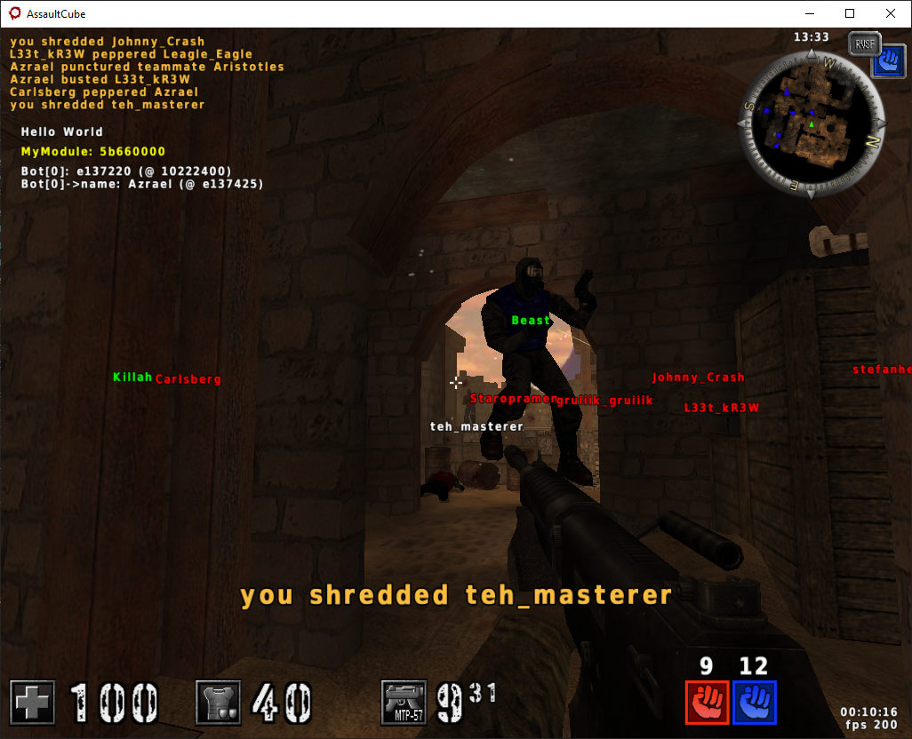
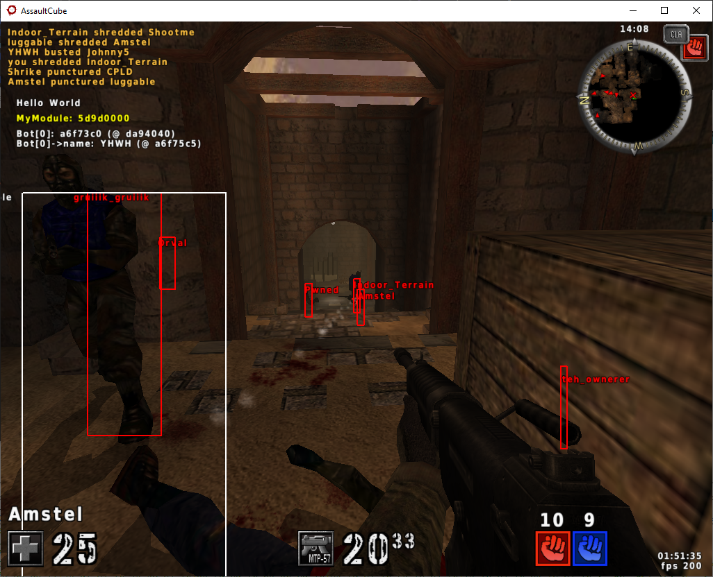

# Chapter 4 - Writing The ESP #

Finally, the moment we've all been waiting for: coding the thing! A lot of people think programming is all about writing code, but those people are fools. If 90% of your time spent on a project is writing code then you're almost certainly writing awful code. Research and planning are huge parts of any project which includes what we were doing in the previous chapters.<br>
Unfortunately, I plan on writing some awful code for this project, but it's at least planned. Hear me out: writing direct, concise code that doesn't take advantage of OOP or any other design paradigms is going to be easier to follow as a beginner than some massive, abstract cheating framework.<br>

Start by creating a Visual Studio project. Use the 'Dynamic-Link Library (DLL)' template under C++ | Windows | Library filter settings. From there, I add in my `#include <MinHook>` statement to the precompiled header file `pch.h` (did you install minhook via vcpkg as recommended at the start?). I also set the 'C++ Language Standard' under 'Project->\<projName> Properties->General' to 'Preview - Features from the Latest C++ Working Draft (/std:c++latest)' for all configurations. Finally, since we know assault cube is x86, I got rid of the x64 build configuration under 'Build->Configuration Manager...' and under the 'Active solution platform' dropdown I chose '\<Edit...>' and selected x64 and removed it.<br>

Finally, it's worth noting that if you're using the code from this repo you will need to install minhook via vcpkg using the x86-windows-static triplet as I modified the vcxproj file to use that triplet (the `VcpkgTriplet` option in 'Globals' PropertyGroup).

## Part 1 - Giving Shape To Our Data ##

So first thing we're going to do is complete the "bridge" we've been building between the game, its compiled form, and now our cheat. We take all the functions and field offsets we gathered before and define them in our program.<br>
The data structures we mapped out in ReClass.NET in the previous chapter can be exported to C/C++ struct definitions which takes care of a lot of the work. To do so, in ReClass.NET, click on the 'Project' tab in the menu toolbar then 'Generate C++ Code...'. This will pop up a window for you to then select all and copy.<br>
In your Visual Studio project, create a new header file (I named mine `game_definitions.h`) and paste. You can fix up the definitions if you want. For example, I decided to make the proper inheritance chain so that `playerent` is derived from both `dynent` (which itself is derived from `physent`) and `playerstate`. I also wrote in the virtual method definitions so Visual Studio would see the vtables and correctly factor that into the total size of the classes. I also have definitions for `animstate`, `poshist`, `weapon`, and `guninfo`. I expect padding to mess up some of these definitions, but that's an easy fix if we encounter such a problem.<br>
In this `game_definitions.h` file I'm also going to include some typedef'd function definitions.<br>
The functions we gathered from the game and will be using are:
* `gl_drawhud` function @ address `0x45F1C0`
* `intersectclosest` function @ address `0x4CA250`
* `text_width` function @ address `0x46E370`
* `draw_text` function @ address `0x46DD20`


Next, we'll also need some openGL functions. We could `#include` openGL in our project, but I'd rather just provide the function definitions and then get the function addresses via `GetProcAddress`. Thinking about what we'll need from openGL and looking at what the game uses (mostly in the game's `renderhud.cpp` and `rendergl.cpp` files), these are the functions I defined:
* `glMatrixMode`
* `glPushMatrix`
* `glPopMatrix`
* `glLoadIdentity`
* `glOrtho`
* `glFrustum`
* `glEnable`
* `glDisable`
* `glBlendFunc`
* `glBegin`
* `glEnd`
* `glColor4f`
* `glVertex2f`
* `glVertex3f`
* `glRotatef`
* `glScalef`
* `glTranslatef`
* `glGetFloatv`
    * might not need since we can read mvpmatrix directly

And since I plan on getting these addresses via `GetProcAddress` calls I decided to move these definitions into their own files: `opengl_wrapper.h` and `opengl_wrapper.cpp`. We'll define a static class to access these functions and also perform all of our `GetProcAddress` calls in its static constructor (or maybe a static `Initialize` method). We could even place our custom drawing functions in this static class too, like `DrawOutline` or something. This way all of our drawing stuff is in its own class.<br>
We can get the exact openGL function definitions from its online documentation.<br>

Finally, we need something to tie this all together, so I created a class called `CheatMain` that will hold all the global references and function pointers we found from the game. This class will also perform all initialization and all cheat-related functionality: it will be the core of our program. Since we'll be doing all of our work from within hooks, we won't have an object reference. We could make a global instance of `CheatMain` and use that, or we could simply make `CheatMain` a pure static class. I'll be choosing to make it purely static.<br>
These are the global references we need to store a pointer to:
* `player1` global reference @ address `0x58ac00`
* `camera1` global reference @ address `0x57e0a8`
* `VIRTW` global reference @ address `0x57ed2c`
* `curfont` global reference @ `0x57ED28`
* `mvpmatrix` global reference @ address `0x57dfd0`
* `bots` global reference @ address `0x591FCC` (vector of playerents)

And of course we'll also store pointers to the functions whose signatures we defined in the `game_definitions.h` file.<br>
I'll include some helpful utility functions, like allocating a console window to print to.<br>

### Part 1 Codebase ###
I'll push a commit containing all the work I've done so far so you can reference the code at this exact moment in time.<br>
You can find it here: https://github.com/kotae4/lab-esp-and-aimbot/tree/Part1Chapter4 <br>
Please note that the guide itself will be changed over time so you should always use the 'main' branch for the non-code portion.<br>

## Part 2 - Drawing Hello World ##
Next, we need to add some meat to it. The first thing I always try to do is to draw the string "Hello World" on screen. So let's add a call to `draw_text` in our `hk_gl_drawhud` function in `CheatMain.cpp`. We can see the default parameters in the game's source code are 255 for color component parameters and -1 for the cursor and maxwidth parameters, so here's what my call looks like: `CheatMain::odraw_text("Hello World", 10, 10, 255, 255, 255, 255, -1, -1);`. Now we're ready to compile and inject it into the game.<br>
I use cheat engine's built-in injector. To do so, open up cheat engine and in the upper left corner click the glowing computer icon and select the game process. Then, click the 'Memory View' button near the bottom left of the main cheat engine window. In the popped up Memory View window open the 'Tools' menu then 'Inject DLL' at the bottom of the list. Select our compiled DLL and when cheat engine asks if you'd like to execute a function click 'No' (DllMain still gets executed, don't worry).<br>

### A Snag With Drawing Text ###
The game crashes immediately. A slight snag in our plans, but this is okay. This is common when you're messing with low-level stuff. So we know we could successfully inject before we added the call to `odraw_text`, so that already narrows it down perfectly. Let's compare how our call looks in assembly against how the call looks in the game's assembly. I load up two instances of my disassembler and load the cheat DLL into one and the game's exe into the other.<br>
So by looking at all the calls to draw_text in the game I can see it's definitely a non-standard calling convention. It looks like the string argument is loaded into the ecx register and the 'left' or X-coordinate argument is loaded into the edx register. The rest of the arguments are pushed onto the stack in reverse order.<br>
If we look at our compiled DLL we can see all the arguments are pushed, none are loaded into registers, hence the crash.<br>
So let's try writing a "wrapper" around `odraw_text` that mimics the assembly we see in the game. Thankfully, since this is x86, we can use `__asm` blocks to write assembly instructions directly. If it were x64 we'd have to use something like asmjit. So here's what I came up with:
```cpp
void CheatMain::draw_text(const char* str, int x, int y, int r, int g, int b, int a /*= 255*/, int cursor /*= -1*/, int maxwidth /*= -1*/)
{
	__asm
	{
		mov ecx, str
		mov edx, x
		push maxwidth
		push cursor
		push a
		push b
		push g
		push r
		push y
		call odraw_text
		add esp, 28
	}
}
```
And I call it like this at the top of `hk_gl_drawhud`, before we call the trampoline:
```cpp
CheatMain::draw_text("Hello World", 1000, 1000, 255, 0, 0);
```

Restarting the game and injecting it again we see that we don't crash anymore, but we also don't see our string being drawn anywhere. Painful.<br>
So now my idea is to go in game and place a breakpoint on the `draw_text` function (remember it's at address `0x46DD20`). We can do this in cheat engine's 'Memory View' window.<br>
The first hit for me is the "FPS 200" string and I can see I got the calling convention right. If I plug the address contained in ECX into ReClass.NET I see the "FPS 200" string. If I plug the address contained in ESP (the stack pointer) into ReClass.NET I can see the arguments that were pushed onto the stack in the same order as we're pushing ours. Everything is as it should be, but we still aren't seeing our string. Now I'm thinking maybe let's just mimic the parameter values of that call, so I change my call to:
```cpp
CheatMain::draw_text("Hello World", 4273, 3504, 255, 255, 255);
```

And after restarting the game and injecting again, I still don't see my string. Very strange. Ah, the graphics state isn't prepared for HUD drawing when our `hk_gl_drawhud` is executed.<br>
So if we look at the game's `gl_drawhud` function in `renderhud.cpp` we can see some initial work at the start:
```cpp
glDisable(GL_DEPTH_TEST);
glMatrixMode(GL_MODELVIEW);
glLoadIdentity();
glMatrixMode(GL_PROJECTION);
glLoadIdentity();
...
glEnable(GL_BLEND);
```
This disables depth, clears the mv and p matrices, and enables blending which is used to get rid of the black background of the font atlas. If we scroll further down to where the first `draw_text` calls start and then look above that for more GL stuff we see:
```cpp
glEnable(GL_TEXTURE_2D);
glOrtho(0, VIRTW*2, VIRTH*2, 0, -1, 1);
```
This allows us to draw with 2d textures (which is what the font atlas is) and multiplies the current matrix (the last set matrix mode - projection in this case) by an orthographic transformation matrix.<br>
So I'm going to move all of this into a new function, `CheatMain::SetupHUDDrawing`, and call that before we start drawing text.<br>
And I just realized I have a bug in my code. In `opengl_wrapper.h` where I define all the GL constants, I accidentally placed an `=` sign between the token and the value. The correct definitions should be:
```cpp
#define GL_DEPTH_TEST 0xb71
#define GL_MODELVIEW 0x1700
#define GL_PROJECTION 0x1701
#define GL_BLEND 0xbe2
#define GL_SRC_ALPHA 0x302
#define GL_ONE_MINUS_SRC_ALPHA 0x303
#define GL_TRIANGLE_STRIP 0x5
#define GL_ONE 0x1
#define GL_TEXTURE_2D 0xde1
```
I also realized I didn't define VIRTH anywhere even though we know it's a constant, so I added `#define VIRTH 1800` to my `CheatMain.h` file.<br>
With those changes, we can compile and inject again, and finally we see our string in the lower right.<br>
We can change the coordinates now so it draws in the top-left. Here's my `hk_gl_drawhud` function now:
```cpp
CheatMain::SetupHUDDrawing();
CheatMain::draw_text("Hello World", 100, 100, 255, 255, 255);

CheatMain::draw_textf(100, 200, 255, 255, 0, "MyModule: %tx", CheatMain::hMod);

CheatMain::ogl_drawhud_trampoline(w, h, curfps, nquads, curvert, underwater, elapsed);
```
I went ahead and added a formatted version of our draw_text wrapper, as you can see. It just writes the formatted varargs into a char buffer then passes that to CheatMain::draw_text.<br>
Finally, a last note, the coordinates passed to these drawing functions are not 1:1 screen coordinates. It seems the game uses a "virtual" coordinate system, hence the presence of `VIRTW` and `VIRTH`. We could translate this virtual coordinate system back to our screenspace coordinate system, but I don't think it's entirely necessary for HUD drawing. Perhaps as we continue toward our goals we'll find a need to do so, I'm not sure yet.<br>

### Part 2 Codebase ###
Anyway, I'll push this commit now before we move on to the rest.<br>
You can view the codebase at this point in time here: https://github.com/kotae4/lab-esp-and-aimbot/tree/Part2Chapter4 <br>
Please note that the guide itself will be changed over time so you should always use the 'main' branch for the non-code portion.<br>

## Part 3 - ESP Functionality ##
Now, let's work on our first major goal: name ESP. We want to draw each player's name over their head.<br>
So I'm going to create another function for this: `DrawNametags`.<br>
In this function I'm going to loop the `bots` vector and perform world-to-screen transformation on each position, then draw their name by calling our `draw_text` with the transformed position.<br>
Ah, it is at this point I realized I have a bug in my definition of `Vector`. The `T** data` should be changed to `T* data`. Easy fix, and no more crashes from that.<br>
The world-to-screen transformation is some complicated math. I linked to some resources in the main guide, so if you're more clever than I am maybe you can understand it.<br>
But since I don't, I'm not even going to bother trying to explain what it does. I cobbled it together from many online sources until it worked. Here it is:
```cpp
Vector4f clipCoords(0.f, 0.f, 0.f, 1.f);
mvpmatrix->transform(bot->o, clipCoords);
if (clipCoords.w < 0.1f) continue;
Vector3f NDCCoords;
NDCCoords.x = clipCoords.x / clipCoords.w;
NDCCoords.y = clipCoords.y / clipCoords.w;
NDCCoords.z = clipCoords.z / clipCoords.w;
Vector3f screenPos;
// normally we'd divide by 2 here as part of the world-to-screen transformation,
// but the "virtual screen coordinate system" the game uses is actually VIRTW * 2 and VIRTH * 2
// so we can skip the divide by 2 by not multiplying VIRTW and VIRTH by 2
screenPos.x = (*VIRTW * NDCCoords.x) + (*VIRTW + NDCCoords.x);
screenPos.y = -(VIRTH * NDCCoords.y) + (VIRTH + NDCCoords.y);
```
Ah, I also added that transform function to the `Matrixf` definition. Again, it's some weird math I don't fully understand, I had to google to find it:
```cpp
void transform(const Vector3f& in, Vector4f& out) const
{
    out.x = ((in.x * data[0]) + (in.y * data[4]) + (in.z * data[8]) + data[12]);
    out.y = ((in.x * data[1]) + (in.y * data[5]) + (in.z * data[9]) + data[13]);
    out.z = ((in.x * data[2]) + (in.y * data[6]) + (in.z * data[10]) + data[14]);
    out.w = ((in.x * data[3]) + (in.y * data[7]) + (in.z * data[11]) + data[15]);
}
```
So now that we can transform world coordinates to screen coordinates we can draw the bot's names above their head. We can also check their `state` and `team` fields to change which color we draw with. I chose to draw white when either they're dead, or I'm dead, or I'm spectating, green when they're a teammate, and red otherwise. I also added some sanity checks to make sure we don't crash.<br>
Here's my complete `DrawNametags` function now:
```cpp
void CheatMain::DrawNametags()
{
	if ((bots == NULL) || (bots->count <= 0) || (bots->data[0] == NULL)) return;

	for (int index = 0; index < bots->count; index++)
	{
		playerent_wrapper* bot = bots->data[index];
		if (bot == NULL) continue;

		// the world-to-screen transformation is some complicated math that i don't fully understand.
		// i usually just copy paste until something works
		// here's some links that may help:
		// https://www.scratchapixel.com/lessons/3d-basic-rendering/computing-pixel-coordinates-of-3d-point/mathematics-computing-2d-coordinates-of-3d-points
		// https://www.3dgep.com/understanding-the-view-matrix/#Transformations
		// https://answers.unity.com/questions/1014337/calculation-behind-cameraworldtoscreenpoint.html
		// https://www.codeproject.com/Articles/42848/A-New-Perspective-on-Viewing
		Vector4f clipCoords(0.f, 0.f, 0.f, 1.f);
		mvpmatrix->transform(bot->o, clipCoords);
		if (clipCoords.w < 0.1f) continue;
		Vector3f NDCCoords;
		NDCCoords.x = clipCoords.x / clipCoords.w;
		NDCCoords.y = clipCoords.y / clipCoords.w;
		NDCCoords.z = clipCoords.z / clipCoords.w;
		Vector3f screenPos;
		// normally we'd divide by 2 here as part of the world-to-screen transformation,
		// but the "virtual screen coordinate system" the game uses is actually VIRTW * 2 and VIRTH * 2
		// so we can skip the divide by 2 by not multiplying VIRTW and VIRTH by 2
		screenPos.x = (*VIRTW * NDCCoords.x) + (*VIRTW + NDCCoords.x);
		screenPos.y = -(VIRTH * NDCCoords.y) + (VIRTH + NDCCoords.y);

		if ((bot->state == CS_DEAD) || 
        ((player1 == NULL) || (player1->state == CS_SPECTATE) || 
        ((player1->state == CS_DEAD) && (player1->spectatemode > SM_NONE))))
			draw_text(bot->name, screenPos.x, screenPos.y, 255, 255, 255);
		else if (bot->team == player1->team)
			draw_text(bot->name, screenPos.x, screenPos.y, 0, 255, 0);
		else
			draw_text(bot->name, screenPos.x, screenPos.y, 255, 0, 0);
	}
}
```

And here's what it looks like in-game:
|  |
|:--:|
| <sub>Image: Nametags drawn over bots, colored based on team and state</sub> | 

Now let's move on to the next feature: drawing outlines around each player.<br>
In chapter 2 we decided we'd write our own drawing function for this, so let's do that.<br>
Basically, we want to draw 4 lines:
* From (xMin, yMin) to (xMax, yMin)
* From (xMax, yMin) to (xMax, yMax)
* From (xMax, yMax) to (xMin, yMax)
* From (xMin, yMax) to (xMin, yMin)

Where xMin, yMin, xMax, and yMax are all just +- some value from the player's position.<br>
We can use the player's `eyeheight` field to offset the y value and `radius` field to offset the x value.<br>
First, we need to find the constant value of `GL_LINE_LOOP`. I search the game's code and find a string near where it's referenced. That string is "T * P x 2". Searching this in my disassembler and I find it's used in 3 places. The first place doesn't match what I'm seeing in the source code, but the second place does. So that brings me to address `0x457BBE` and somewhere further down I see two calls to `glLineWidth`, just after the first call is a call to `glBegin`. The parameter passed to that call is the value of `GL_LINE_LOOP`, which is `0x2`. I add that to `opengl_wrapper.h` before moving on.<br>
Here's what I came up with for the drawing function:
```cpp
void CheatMain::DrawOutline2d(float xMin, float yMin, float xMax, float yMax)
{
	opengl_wrapper::oglBegin(GL_LINE_LOOP);
	opengl_wrapper::oglVertex2f(xMin, yMin);
	opengl_wrapper::oglVertex2f(xMax, yMin);
	opengl_wrapper::oglVertex2f(xMax, yMax);
	opengl_wrapper::oglVertex2f(xMin, yMax);
	opengl_wrapper::oglEnd();
}
```

And the function that calls it:
```cpp
void CheatMain::DrawPlayerOutlines2d()
{
	if ((bots == NULL) || (bots->count <= 0) || (bots->data[0] == NULL)) return;

	for (int index = 0; index < bots->count; index++)
	{
		playerent_wrapper* bot = bots->data[index];
		if (bot == NULL) continue;

		Vector3f botMin(bot->o.x - bot->radius, bot->o.y, bot->o.z - bot->eyeheight);
		Vector3f botMax(bot->o.x + bot->radius, bot->o.y + bot->radius, bot->o.z);

		Vector3f botScreenMin, botScreenMax;
		bool onScreenMin, onScreenMax;
		onScreenMin = WorldToScreen(mvpmatrix, botMin, *VIRTW, VIRTH, botScreenMin);
		onScreenMax = WorldToScreen(mvpmatrix, botMax, *VIRTW, VIRTH, botScreenMax);

		if ((onScreenMin == false) && (onScreenMax == false)) continue;

		DrawOutline2d(botScreenMin.x, botScreenMin.y, botScreenMax.x, botScreenMax.y);
	}
}
```
You can see I moved the world-to-screen logic into its own function.<br>
I then add a call to `CheatMain::DrawPlayerOutlines2d` inside our `hk_gl_drawhud` underneath the `CheatMain::DrawNametags` call.<br>
Compiling this and injecting it into the game will result in... nothing. To debug why it's not drawing anything, I added a separate call to `CheatMain::DrawOutline2d` inside `hk_gl_drawhud` using hardcoded coordinates that should **definitely** appear on screen, and compiling and injecting again draws nothing.<br>
So at this point I'm thinking it's the graphics state again so I look at places in the game's code where a call to `box2d` is made and the first one I find is in `editing.cpp` around line 794. I can see it calls glDisable twice to disable GL_BLEND and GL_TEXTURE_2D before calling box2d, then glEnable again to re-enable them afterwards.<br>
This makes sense because we're drawing a primitive line instead of textures, and we don't have any need to blend colors either. If I had more experience with openGL I wouldn't have made this mistake, but such is life.<br>
Here's the fixed `DrawOutline2d` function:
```cpp
void CheatMain::DrawOutline2d(float xMin, float yMin, float xMax, float yMax, float colorR, float colorG, float colorB)
{
	opengl_wrapper::oglDisable(GL_BLEND);
	opengl_wrapper::oglDisable(GL_TEXTURE_2D);
	opengl_wrapper::oglColor4f(colorR, colorG, colorB, 1.f);
	opengl_wrapper::oglBegin(GL_LINE_LOOP);
	opengl_wrapper::oglVertex2f(xMin, yMin);
	opengl_wrapper::oglVertex2f(xMax, yMin);
	opengl_wrapper::oglVertex2f(xMax, yMax);
	opengl_wrapper::oglVertex2f(xMin, yMax);
	opengl_wrapper::oglEnd();
	opengl_wrapper::oglEnable(GL_BLEND);
	opengl_wrapper::oglEnable(GL_TEXTURE_2D);
}
```
I also added customizable colors so we can draw enemies and teammates differently like with the nametags. This involved changing `CheatMain::DrawPlayerOutlines2d` as well, so it looks even more like `CheatMain::DrawNametags`, but that's okay. I also changed the conditional that checks onScreenMin and onScreenMax to continue if either is false, this should get rid of glitchy boxes when a player is just barely on screen.<br>
Here's what it looks like in-game now:
|  |
|:--:|
| <sub>Image: Nametags drawn over and boxes around bots, colored based on team and state</sub> | 


And with that we are done with our first major goal: ESP functionality!<br>

### Part 3 Codebase ###
Before we move on to the next major goal, aimbot functionality, I'll push this commit.<br>
You can view the codebase at this specific point in time using this link: https://github.com/kotae4/lab-esp-and-aimbot/tree/Part3Chapter4 <br>
Please note that the guide itself will be changed over time so you should always use the 'main' branch for the non-code portion.<br>