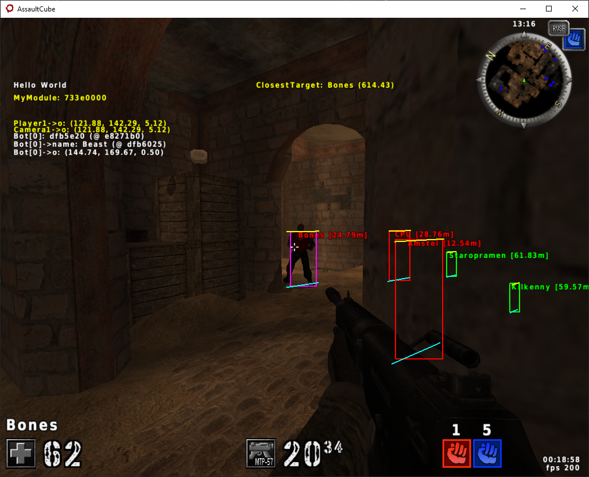

# Chapter 5 - Writing The Aimbot #

The aimbot is our next major goal and there's usually only two big problem areas:
1. Calculating the angle between our player and the target player
2. Detecting if there's a wall or other solid object between us and the target player (raycast / traceline / etc)

The first one involves some complicated math that I don't fully understand. If I were to guess, I'd say this math is slightly less complicated than the math used for the world-to-screen transformation. Again, because I don't fully understand it, I can't really explain it and I usually just google wildly and try whatever I can find until it works.<br>
Google-fu is truly an invaluable skill.<br>

The second one just involves calling the `intersectclosest` function we found. Nearly every game engine will have a similar function regardless of whether it's 2D or 3D. A lot of game functionality requires knowing if something is in the bounds of something else.<br>

Now let's get into the code. First of all, our aimbot needs a target, so I'm going to create a `FindNearestTarget` function that loops over the bots and returns the one that's closest and not behind a wall (this is where `intersectclosest` comes in).<br>
Here's what I came up with:
```cpp
if (player1->state != CS_ALIVE) return NULL;
	if ((bots == NULL) || (bots->count <= 0) || (bots->data[0] == NULL)) return NULL;

	float bestDistSquared = 0.f;
	int hitZone = -1;
	for (int index = 0; index < bots->count; index++)
	{
		playerent_wrapper* bot = bots->data[index];
		if ((bot == NULL) || (bot->state == CS_DEAD)) continue;

		playerent_wrapper* target = ointersectclosest(player1->o, bot->o, player1, bestDistSquared, hitZone, true);
		if (target != NULL)
		{
			return target;
		}
	}

	return NULL;
```

## Snag with intersectclosest ##

And it crashes. It's not a hard crash like with `draw_text` but it is irrecoverable. So since we already experienced issues with `draw_text` having a weird calling convention the first thing I do is load up my disassembler and go back to that call we found in `gl_drawhud`. We know `playerincrosshair` got inlined so the call we see is actually to `intersectclosest`. So, as expected, it is a weird calling convention again. I'm guessing the global reference moved into edx is the "worldpos" that's passed as the second argument (the "to" parameter), and there's some compiler trickiness happening with the ecx register. First of all, slightly above the call we see that `camera1` is moved into ecx. That's what gets pushed to the call as the third argument (the "at" parameter), and then the compiler adds 4 to ecx which we know 4 is the offset to the `o` or origin field of the `physent` struct. So when the function is called, ecx contains the "from" parameter and edx contains the "to" parameter and both are pointers to vector3s. The rest of the arguments are pushed onto stack in reverse order which is normal.<br>
So we'll have to write a "wrapper" for this function again, using inline assembly:
```cpp
playerent_wrapper* CheatMain::intersectclosest(const Vector3f& from, const Vector3f& to, const playerent_wrapper* at, float& bestdistsquared, int& hitzone, bool aiming /*= true*/)
{
	playerent_wrapper* retVal = NULL;
	__asm
	{
		mov ecx, from
		mov edx, to
		push aiming
		push hitzone
		push bestdistsquared
		push at
		call ointersectclosest
		add esp, 16
		mov retVal, eax
	}
	return retVal;
}
```

We can now call it without crashing, but we still aren't getting the desired result. The function returns a player even if that player is behind a wall.<br>
Looking at the game code more closely this time, I now see that map geometry isn't actually being checked. When the inlined `playerincrosshair()` function calls `intersectclosest`, it passes the `worldpos` global reference. `worldpos` is the point in the world where your crosshair is resting and when the game calculates this it **does** check map geometry with a call to `intersectgeometry`. This is called from `readdepth()` which is called from `gl_drawframe` in rendergl.cpp.<br>
Since I don't want to make the same mistake, I'm going to actually read through `intersectgeometry` before deciding to use it.<br>
So `intersectgeometry` seems to loop a global reference called `world` which sounds promising. However, the function doesn't return a true or false value indicating whether a collision occurred. Instead, it simply shortens the `from` parameter to where the collision occurred. Since I can see edge cases where a collision occurs at the exact end of the ray and floating point equality tests not being super reliable I don't think this is a good function to use.<br>

So it's essentially back to the drawing board for finding a Raycast / Traceline function. All is not lost, though, because we have one big clue: bots exist. Bots have to know whether there's a wall between them and their target. So my idea is to look through the bot code and see what I can find.<br>
I open up the `bot` folder in the game's source code and immediately my eyes are drawn to... `bot_util.h`. I love utility functions as they usually contain loads of useful functions for us. So I see a `TraceLine` function and a `IsVisible` function. Looking at `IsVisible` I can see it just calls `TraceLine` and returns the `traceresult_s->collided` field (this struct is also defined in `bot_util.h` btw).<br>
So now the plan is to see if `TraceLine` or any of its callers contain strings that we could search for in our disassembler. This would make it really easy to find the function address. I don't see any strings in `TraceLine` itself, so I do a search for what calls it.<br>
I see console commands being registered in `botmanager.cpp` but I also see they're wrapped in a `#ifndef RELEASE_BUILD` so they won't be in our binary. I do see some strings in the `CBot::DoCombatNav` function in `bot_ai.cpp` but they call `condebug` and searching for its implementation I can see it's wrapped in the same preprocessor conditional. Same with `debugnav` and `AddDebugText`.<br>
So I couldn't find any strings in the callers of `TraceLine` either. Now, we could continue on to the callers of the callers... but that gets tedious real fast. Still, if worst comes to worst that is an option.<br>
For now, instead, I'll look at the `bot.h` file and I see the definition of `CBot` class has a virtual function named `Think`.<br>
And `CBot::Think` calls a juicy sounding function named `MainAI`, and that calls a function named `FindEnemy` which calls `IsVisible` which finally calls `TraceLine`. I know this seems like a lot, but familiarizing yourself with large codebases is part of the job and makes you a great asset on any team.<br>
So how do we even find `CBot::Think`? Well it's a virtual function, so it'll be part of the virtual table. Thankfully, the game has some Runtime Type Information (RTTI).<br>
In IDA we can use the ClassInformer plugin to parse the RTTI data. It'll show us a new window containing a bunch of classes. Look for `CBot` and double click it to be brought to `CBot::'vftable'`.<br>
In Ghidra, RTTI data is parsed by default (no plugin needed) so if we look at the 'Symbol Tree' window and uncollapse the 'C' folder we should see `CBot`. Uncollapse that to see its vftable.<br>
It's at address `0x55A048`. Now we just count the number of virtual functions defined before our `Think` function: 8. It also helps that it's the last defined virtual function. In general, compilers will lay these things out according to the order they appear in the source code. That's true for most things too, not just virtual functions.<br>
So we finally find `CBot::Think` at address `0x5021F0`. Now we just have to follow that call chain all the way to `TraceLine`.<br>
The first one, `MainAI` is easy because it's part of a conditional: it checks if a value is false and if it is it calls `MainAI` otherwise it calls something else. I found the call at `0x50237F`.<br>
Second, `FindEnemy` is a little trickier but if you notice `BotManager.BotsShoot()` is checked a million different times in this function and realize that it's been inlined then this serves as a pretty good pattern, then it's just a matter of counting the occurences. The second occurence, and the call we're looking for, is around address `0x507F16`.<br>
The third call we're looking for is `IsVisible`. There's some stuff in this one that doesn't quite match up with the source code, but once we realize that it's pretty easy to find what we're looking for. Just before the call to `IsVisible`, both `physent->state` and `physent->team` are referenced, and `CS_ALIVE` is checked too. We know the field offsets and value so it's pretty easy to find the call around address `0x5072F2`.<br>
Finally, `IsVisible` is a short function and only contains one call so that's obviously our `TraceLine` call found at address `0x42D3EC` and the actual address of `TraceLine` itself is `0x509010`.<br>
Before we plug that into our program, notice that the calling convention is weird once again. This time, ecx is xor'd just before the call. Maybe that's the last parameter, 'SkipTags', but I doubt it. We can see the ecx register is being set to the stack pointer and then assigned float values. So it seems the first two parameters, the vectors 'from' and 'to', are being put onto the stack. I think ecx being xor'd is because no caller of `IsVisible` provides a 'pTracer' parameter, so the default is always used which is NULL. Other callers of `TraceLine` seem to put 'pTracer' in the ecx register. One of the bool parameters is put into the dl register which is the low byte of edx. My guess is the 'CheckPlayers' parameter. That leaves us with 2 parameters remaining: the pointer to a traceresult_s struct and the last bool. If we look at how they're used in the `TraceLine` function we can deduce that they are pushed onto the stack as well.<br>
So the calling convention makes sense now: the first two parameters that can fit into a register are put into ecx and edx (in that order) and the rest of the parameters are pushed onto the stack starting from right-most. I don't know how to get visual studio to follow that calling convention (and I'm far too lazy to look it up) so I'll still be writing "wrapper" functions using inline assembly.<br>
Here's what I got:
```cpp
void CheatMain::TraceLine(Vector3f from, Vector3f to, dynent_wrapper* pTracer, bool CheckPlayers, traceresult_wrapper* tr)
{
	__asm
	{
		push 0
		push tr
		push to.z
		push to.y
		push to.x
		push from.z
		push from.y
		push from.x
		mov ecx, pTracer
		mov dl, CheckPlayers
		call oTraceLine
		add esp, 0x20
	}
}
```

And here's how I use it in my `FindNearestTarget` function:
```cpp
playerent_wrapper* CheatMain::FindNearestTarget()
{
	if ((player1 == NULL) || (player1->state != CS_ALIVE)) return NULL;
	if ((bots == NULL) || (bots->count <= 0) || (bots->data[0] == NULL)) return NULL;

	playerent_wrapper* closestTarget = NULL;
	for (int index = 0; index < bots->count; index++)
	{
		playerent_wrapper* bot = bots->data[index];
		if ((bot == NULL) || (bot->state == CS_DEAD) || (bot->team == player1->team)) continue;

		traceresult_wrapper tr{};
		TraceLine(player1->o, bot->o, player1, false, &tr);
		if (tr.collided == false)
		{
			float distSquared = Vector3f::squareddist(player1->o, bot->o);
			if (distSquared < AimDistance)
			{
				AimDistance = distSquared;
				closestTarget = bot;
			}
		}
	}

	return closestTarget;
}
```

And I made some globals so we can color the outline of the target player differently, `AimDistance` and `AimTarget`. Then I modified the `DrawPlayerOutlines2d` function to do the different coloring. This makes it easier to see if it's working as intended or not. It's important to note that the 'CheckPlayers' parameter of `TraceLine` should be `false` because we don't want our ray intersecting with a player to be a bad thing. We only care about collisions with map geometry.<br>
Loading up the game and injecting we can see it works really well.

## Taking Aim ##

So now that we have a function that gives us the nearest visible target, all that remains is to make our player look at that target.<br>
So we need some way of calculating the "aim angle" between us and them and then setting our player's pitch and yaw accordingly.<br>
As mentioned before, calculating the aim angle is some weird math that I don't understand, but here's the function I'll be using that I found on google:
```cpp
// credit: Rake / h4nsbr1x via [https://guidedhacking.com/threads/ultimate-calcangle-thread-how-to-calculate-angle-functions.8165/#post-73276]
Vector3f CalcAngle(Vector3f src, Vector3f dst)
{
	Vector3f angle;
	float dist = Vector3f::dist(src, dst);

	angle.x = -atan2f(dst.x - src.x, dst.y - src.y) / PI * 180.0f + 180.0f;
	angle.y = asinf((dst.z - src.z) / dist) * Rad2Deg;
	angle.z = 0.0f;

	return angle;
}
```

And, finally, the function to tie it all together:
```cpp
void CheatMain::DoAimbot()
{
	if ((player1 == NULL) || (player1->state != CS_ALIVE)) return;

	AimDistance = 3.402823466e+38F;
	AimTarget = FindNearestTarget();

	if (AimTarget != NULL)
	{
		Vector3f aimAngle = CalcAngle(player1->o, AimTarget->o);
		player1->rotation.x = aimAngle.x;
		player1->rotation.y = aimAngle.y;
	}
}
```

Going in-game we can see it works flawlessly:
|  |
|:--:|
| <sub>Image: Magenta outline for the nearest **visible** aim target</sub> | 

## Codebase ##

You can view the codebase at this specific point in time using this link: https://github.com/kotae4/lab-esp-and-aimbot/tree/Chapter5 <br>
Please note that the guide itself will be changed over time so you should always use the 'main' branch for the non-code portion.<br>

## Summary ##

All that's left are minor improvements and maybe some extra features, but we accomplished the major goals we set out for ourselves: ESP functionality and aimbot functionality.<br>
If you've followed along and performed the same searching, analyzing, and testing that was covered in the guide then you should feel proud of yourself! Not very many people know how to build something like this.<br>
Hopefully this walkthrough provided a helpful level of detail and shed some light on the shadowy world of game hacking too :)